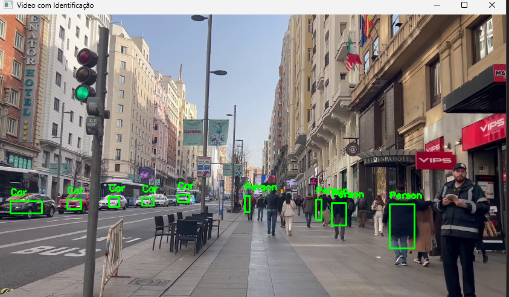

# Projeto de Visão Computacional

## Objetivo: Detecção de Pessoas e Carros usando OpenCV e YOLO

Este projeto tem como objetivo implementar um sistema de visão computacional capaz de identificar seres humanos e carros em imagens ou vídeos. Para alcançar esse objetivo, será utilizado o OpenCV, uma biblioteca de visão computacional, juntamente com o modelo YOLO (You Only Look Once) para detecção de objetos em tempo real.

A detecção de objetos será realizada por meio do YOLO, um framework de aprendizado profundo que permite a detecção eficiente de múltiplos objetos em uma única passagem pela rede neural. A utilização do OpenCV facilitará a manipulação e processamento de imagens, proporcionando uma integração eficiente com o modelo YOLO.

Ao finalizar este projeto, espera-se ter um sistema robusto capaz de identificar e delimitar com precisão seres humanos e carros em diferentes contextos visuais, contribuindo para aplicações práticas em segurança, monitoramento e reconhecimento de objetos em tempo real.

Prévia: 
